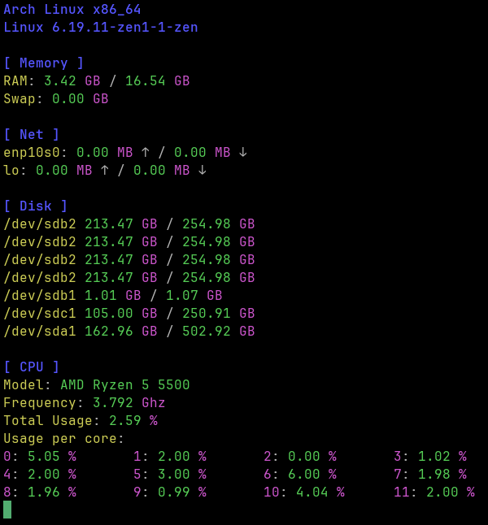

# Scout
A CLI-Based System Monitoring tool written in Rust.

## What is this project about?
Scout is a minimalist CLI tool for monitoring your system. Currently, the following aspects of a system can be monitored:

- CPU
- RAM
- Net
- Disk
- OS

The following aspects are planned:

- GPU (maybe)

Current aspects may also be further improved, so they can, for example, show more data.

## Compilation
```bash
git clone https://github.com/Moritisimor/scout
cd scout
cargo build -r
cd target/release
```

Now to execute:
```bash
./scout
```

## Screenshots
On Arch Linux


